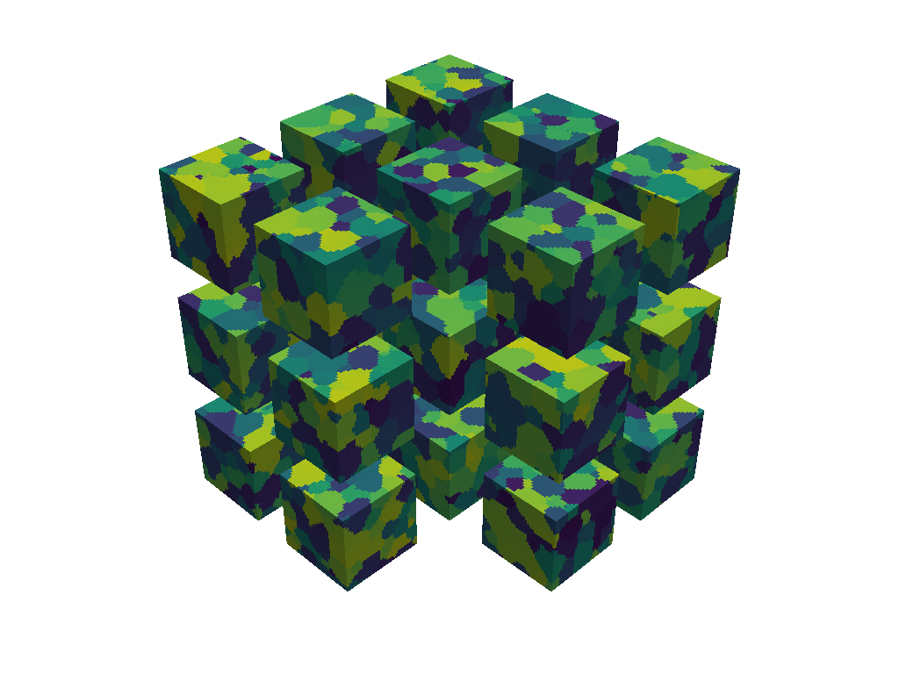

<p align="center">
  <br/>
  <br/>
  <i>Sample results</i>
</p>

# GrainPaint
This is the repository for our article "GrainPaint: A multi-scale diffusion-based generative model for microstructure reconstruction of large-scale objects" available online [here](https://doi.org/10.1016/j.actamat.2025.120784).
The dataset used to train GrainPaint is available at https://zenodo.org/record/8241535. 

If you found this repository helpful, please consider citing our journal article.
```bib
@article{hoffman2025grainpaint,
  title={GrainPaint: A multi-scale diffusion-based generative model for microstructure reconstruction of large-scale objects},
  author={Hoffman, Nathan and Diniz, Cashen and Liu, Dehao and Rodgers, Theron and Tran, Anh and Fuge, Mark},
  journal={Acta Materialia},
  volume={288},
  pages={120784},
  year={2025},
  publisher={Elsevier}
}
```

# Update From Publication
We have pushed new trained models not discussed in our publication. These models are faster than the original models with the same output quality. 
In our testing, the new models are about 5 times faster than the old models. The new models and the associated testing and training scripts have small in their names.

# Installation
1. Clone the repository.
2. Create and activate a new python environment. Tested with Python 3.13.
3. Run `pip install -r requirements.txt` to install the dependencies.

# Training
We provide the models we used in our paper in the model_chekpoints folder, so training a model is not necessary if you want to use one of our pre-trained models. 
A model can be trained using `train_ddm_diffusers32.ipynb`. 
A batch size of 8 fits in 24GB of memory, if you have less you should reduce batch_size.

# Generation
Microstructures can be generated using `generation_32_aniso.py`. 
`ddm_load_path` stores the path to the pre-trained model to be loaded. 
`ddm32_big_250.ckpt` is the model trained on isotropic grain structures, `ddm32_big_250_aniso.ckpt` is the model trained on anisotropic grain structures.
We provide a `generation_plan` variable in `generation_32_aniso.py` that can be used to switch the generation plan between `grid` and `center`
`grid` is recommended for isotropic microstructures, `center` is recommended for anisotropic microstructures.
You will need to update the range for `run_num` when running the script multiple times.

# Analysis
We provide our analysis scripts in the analysis folder. 
* `compareMsStats2.py` contains functions to calculate grain volume and orientation statistics,
* `compareMsStats2_centroid_dist.py` contains functions to calculate the centroid distance statistics. 

Please note that the `reEnumerate` function must be run on microstructures before analysis. `HDBscan_para.py` must be run on the output of diffusion model to segment the grains before the statistics can be analysed. 
